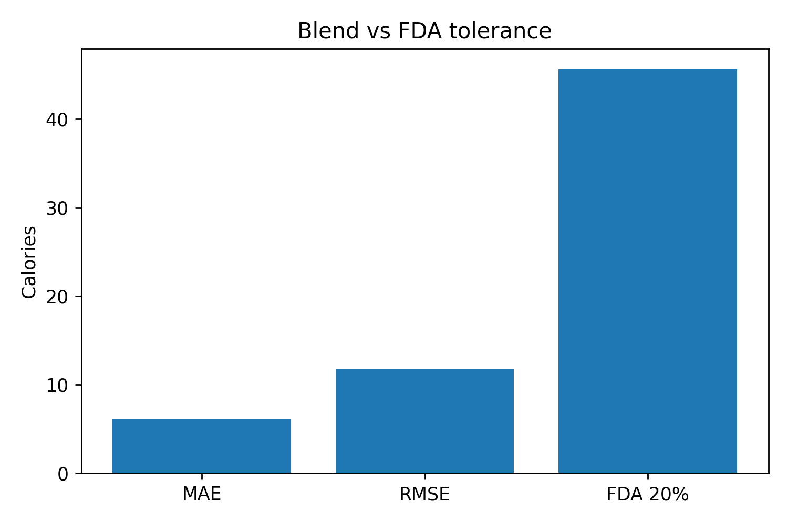

# Calorie Predictor Report

## Features Used
Mandatory: protein, carbohydrate, total_fat, serving_weight, calories

Optional: saturated_fat, fiber, sugar, sodium

## Results
|Model|RMSE|MAE|R²|
|---|---|---|---|
|HGB|13.80|7.36|0.993|
|Ridge|12.12|6.19|0.995|
|Blend|11.78|6.10|0.995|

## FDA Comparison

